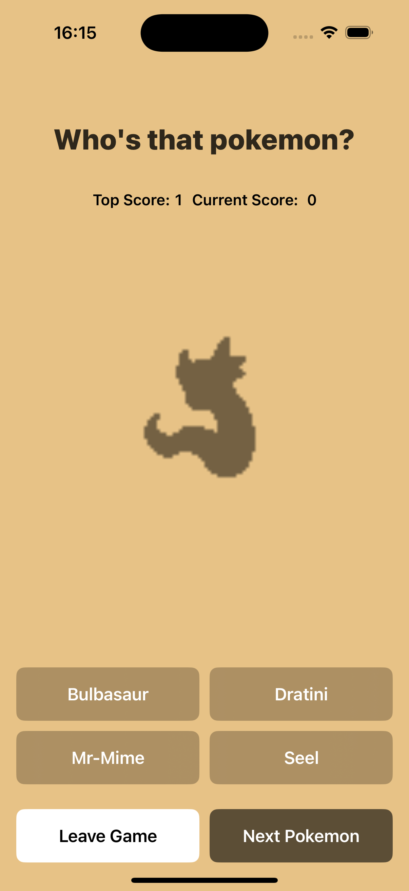
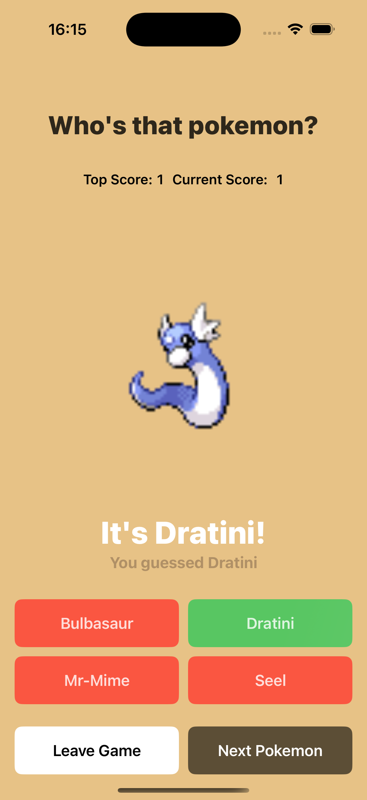

# WhosThatPokemon
 

# Overview
A very simple and modern version of "Who's that pokemon?" inspired by the original show segment
Guess the pokemon by the silhoutte and try to beat your own high score.

# Tech Stack & Development
- Swift and SwiftUI 
- XCTest for Unit Testing

- MVVM and Protocols for simplicity and easier testing.
- Extensive use of view modifiers for cleaner, reusable code and a more SwiftUI feel.
- Dark Mode available out of the box due to standard color.
- Works on iPad.

- The main view is driven by a enum that changes depending on successful/failed network calls.

# 3rd Party packages
[Pow](https://github.com/EmergeTools/Pow) for seamless animations.

# Future Development Ideas
- Accessibility
- Better error handling
- Hard mode (with textfield instead of buttons)

